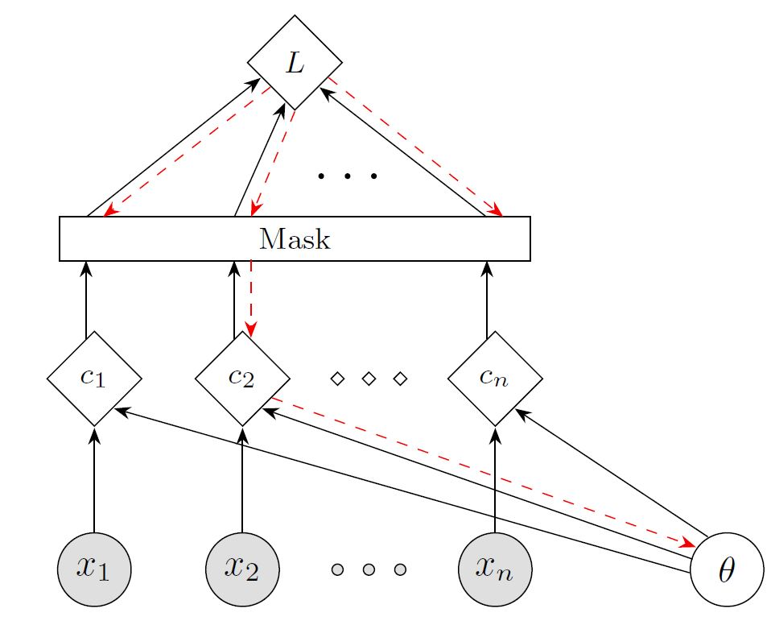
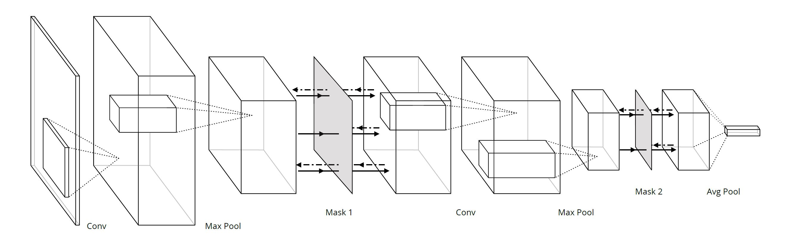
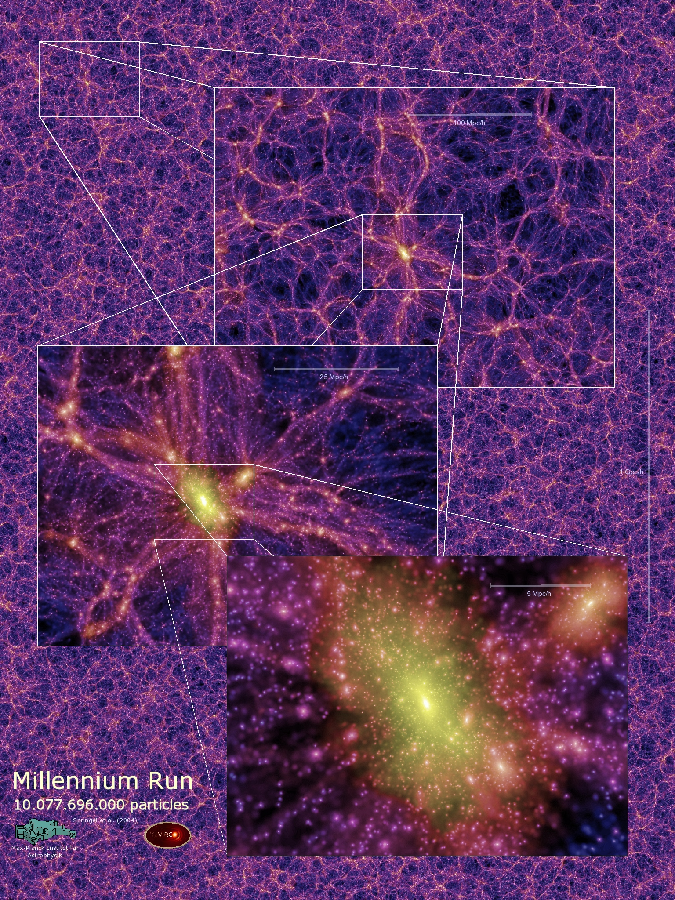
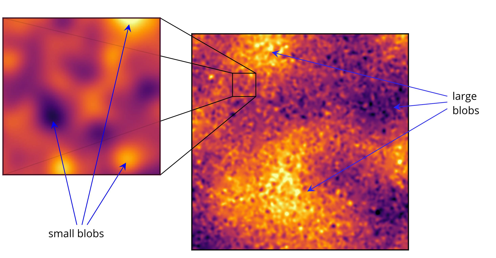

# Backdrop: stochastic backpropagation [](https://doi.org/10.5281/zenodo.1252464) [](https://mybinder.org/v2/gh/dexgen/backdrop/master)

* Siavash Golkar
* Kyle Cranmer

## Summary
[Backdrop](https://arxiv.org/abs/1806.01337) is a flexible and easy to implement tool for introducing stochasticity to the gradient and can be  intuitively  described as dropout along the backpropagation pipeline. Backdrop can lead to a significant improvement in optimization performance in problems where stochastic gradient descent is not suitable or well defined. These generally fall into two main classes: 1) problems with non-decomposable losses and 2) problems where each sample can be intuitively considered as being hierarchically comprised of many smaller subsamples. 


## Implementation

<p> 
Similar to dropout, backdrop is implemented via the insertion of one or more masking layers in the network. Backdrop masking layers are transparent during the forward pass but block random parts of the gradient along the backward pass. In problems where the loss function is non-decomposable, backdrop acts by only propagating the gradient with respect to a randomly chosen subset of the samples. Here is a cartoon of this process, where the x's are the samples, the c's are some latent variable derived from individual samples, and L is the non-decomposable loss. We denote the forward pass by solid black lines and backward gradient computation pass by dashed red lines. In this example, all samples are used to compute the loss L, but only the gradient with respect to sample x_2 is being used for the optimization step. </p>

In the second class of problems where each sample has a hierarchical structure, backdrop can be implemented to mask features detected in a convolutional network.  Below is an example of two backdrop masking layers in a convolutional network.


<p align="center">
  
</p>

 An example of the masks generated during the backward pass of this network is given below. Note that in this case stochasticity is introduced because the gradient is propagated for only a fraction of the various parts of the input.

<p align="center">
  
</p>

For details and results from experiments that demonstrate performance improvements with backdrop see the [paper](https://arxiv.org/abs/1806.01337).

## Examples



There are two general classes of problems where backdrop can improve generalization.  First, optimization of loss functions that cannot be decomposed into a sum of individual sample losses. For example global performance measures such as F-measures and ROC AUC fall into this calss. Similarly, problems where we would like to impose some desired structure on the latent space are often not decomposable. For these class of problems, the loss cannot be evaluated on individual samples so stochastic gradient descent is not applicable. Moreover, often they can not be well approximated with small batch sizes; therefore, minibatch SGD is also not well suited. 

The second class of problems are optimization tasks on datasets that have a small number of information-rich samples, each of which is comprised of many smaller subsamples. Examples include sequences, graphs, images, time-series as well as many physics based scenarios. For instance, the Millenium Run (see image), a cosmology simulation that traces the evolution of the matter distribution of the Universe, is a demonstrative example of this class of problems. At the largest scale, the image is a web of filaments. As we zoom in, we start seeing more structure, corresponding to the dark matter halos and eventually we see many galaxies inside each halo.  For this class of problems, one would like to take advantage of the many realizations of the objects at the different scales in the problem. 

### Gaussian process texture dataset

As a benchmark for hierarchical multi-scale problems, we created the two-scale Gaussian process dataset, where each sample is comprised of a number of large and small blobs. Each large or small blob can be considered an independent realization at that scale. We considered a classifiction problem for four classes defined by the length scale associated to the large and small blobs. The 2-scale nature of the data poses a problem for approaches based on cropping at a single scale. For a demonstration of the GP dataset generator see [gp-generate-demo.ipynb](gp-generate-demo.ipynb)

<p align="center">
  
</p>

With backdrop we can approach this problem using a convolutional network which incorporates two backdrop masking layers inserted at points along the network that correspond to convolutional layers with receptor fields comparable to the size of the blobs. During the forward pass of the network, the objective is evaluated using the entire sample but during the backward pass, the gradients are only propagated for a random patches of the data. Specifically, the weights of the coarser convolutional layers will get updated according to the surviving patches of the large scale mask, and  the weights of the finer convolutional layers will get updated according to the surviving patches of the small scale mask. For a demonstration of how this works in practice, see [backdrop-demo.ipynb](backdrop-demo.ipynb).

<hr>

For more details and results regarding performance improvements with backdrop see the [paper](https://arxiv.org/abs/1806.01337). For implementation of backdrop via a masking layer see [backdrop-demo.ipynb](backdrop-demo.ipynb). For a demonstration of the GP dataset generator see [gp-generate-demo.ipynb](gp-generate-demo.ipynb). The dataset used in the paper is [provided on Zenodo](https://zenodo.org/record/1252464#.WwcpbkgvwuU) under dataset.zip. 


For [backdrop](https://arxiv.org/abs/1806.01337), please cite using the following BibTex entry:

```

@ARTICLE{golkar2018,
   author = {{Golkar}, S. and {Cranmer}, K.},
    title = "{Backdrop: Stochastic Backpropagation}",
  journal = {ArXiv e-prints},
archivePrefix = "arXiv",
   eprint = {1806.01337},
 primaryClass = "stat.ML",
 keywords = {Statistics - Machine Learning, Computer Science - Learning},
     year = 2018,
    month = jun,
   adsurl = {http://adsabs.harvard.edu/abs/2018arXiv180601337G}
}

```
For the multi-scale Gaussian process dataset, please cite:
 
```
@misc{golkar_siavash_2018_1252464,
  author       = {Golkar, Siavash and
                  Cranmer, Kyle},
  title        = {Multi-scale Gaussian process dataset},
  month        = may,
  year         = 2018,
  doi          = {10.5281/zenodo.1252464},
  url          = {https://doi.org/10.5281/zenodo.1252464}
}
```